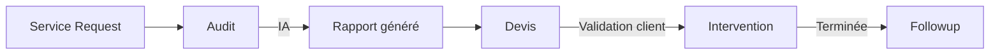

# 🎯 Workflow IMOTION - Documentation Complète

## Vue d'ensemble

Le workflow IMOTION gère l'ensemble du cycle de vie client, de l'audit initial à l'accompagnement post-projet, avec génération automatique par IA, emails et PDFs.

## 🗂️ Architecture des données

### Tables principales

1. **audits** - Rapports d'audit générés par IA
   - `id`, `request_id`, `client_id`, `company_id`
   - `title`, `scope`, `status`, `report_pdf_url`
   - Status: `En attente IA` | `Prêt` | `Validé admin` | `Rejeté`

2. **quotes** - Devis commerciaux
   - `id`, `audit_id`, `client_id`, `company_id`
   - `title`, `description`, `amount_ht`, `amount_ttc`, `pdf_url`
   - Status: `En attente` | `En attente validation client` | `Validé` | `Refusé` | `Négociation`

3. **interventions** - Projets et interventions
   - `id`, `quote_id`, `client_id`, `company_id`, `technician_id`
   - `title`, `status`, `start_date`, `end_date`, `planning`, `report_pdf_url`
   - Status: `En attente` | `Planifiée` | `En cours` | `Terminée` | `Clôturée`

4. **followups** - Suivi post-projet
   - `id`, `client_id`, `project_id`
   - `type`, `notes`, `next_action`, `next_action_date`
   - Types: `onboarding` | `support` | `optimisation` | `upsell`

5. **workflow_logs** - Journalisation complète
   - `entity_type`, `entity_id`, `action`, `details`, `performed_by`

## 🔄 Flux de travail



### Étape 1 : Audit
1. Admin ouvre `/admin/audits`
2. Clique "IA → Rapport" sur un audit
3. Edge function `generate-audit-report` :
   - Appelle Lovable AI (Gemini 2.5 Flash)
   - Génère rapport HTML
   - Upload vers `audit-reports` bucket
   - Envoie email au client + ops@imotion.tech
   - Log dans `workflow_logs`

### Étape 2 : Devis
1. Admin crée devis depuis audit
2. Clique "Générer PDF" → `generate-quote-pdf`
3. Clique "Envoyer" → `workflow-hook` (kind: onQuoteSent)
4. Client reçoit email avec PDF et lien validation

### Étape 3 : Validation
1. Client ouvre `/client/quotes`
2. Clique "Valider le devis"
3. `workflow-hook` (kind: onQuoteValidated)
   - Crée automatiquement une `intervention`
   - Envoie email de confirmation
   - Log dans `workflow_logs`

### Étape 4 : Intervention
1. Admin planifie depuis `/admin/interventions`
2. Assigne technicien, dates
3. `workflow-hook` (kind: onInterventionPlanned)
4. Client suit avancement sur `/client/projects`

### Étape 5 : Clôture & Suivi
1. Admin marque "Terminée"
2. `workflow-hook` (kind: onInterventionCompleted)
   - Crée automatiquement un `followup`
   - Programme action dans 7 jours
   - Email de satisfaction

## 🔐 Sécurité (RLS)

### Audits
- ✅ Admins : accès total
- ✅ Clients : lecture de leurs propres audits

### Interventions
- ✅ Admins : accès total
- ✅ Clients : lecture de leurs projets

### Quotes
- ✅ Admins : accès total  
- ✅ Clients : lecture + validation de leurs devis

### Followups
- ✅ Admins : accès total
- ✅ Clients : lecture de leur suivi

## 📧 Emails automatiques

Tous les emails incluent **BCC: ops@imotion.tech**

1. **Audit prêt** - Template `auditReadyEmail()`
2. **Devis envoyé** - Template `quoteSentEmail()`
3. **Devis validé** - Template `quoteValidatedEmail()`
4. **Projet planifié** - Template `projectPlannedEmail()`

## 🎨 Pages créées

### Admin
- `/admin/audits` - Gestion audits + IA
- `/admin/quotes` - Gestion devis + PDF
- `/admin/interventions` - Suivi projets
- `/admin/followups` - Accompagnement

### Client
- `/client/quotes` - Validation devis
- `/client/projects` - Suivi projets

## ⚡ Edge Functions

1. **generate-audit-report**
   - Modèle IA: `google/gemini-2.5-flash`
   - Génère rapport HTML structuré
   - Upload storage + email

2. **generate-quote-pdf**
   - Génère devis HTML avec branding
   - Calculs HT/TTC automatiques

3. **workflow-hook**
   - Gère transitions d'état
   - Emails selon événement
   - Logs toutes actions

## 📊 Logs & Traçabilité

Chaque action importante est loggée dans `workflow_logs` :
- `AUDIT_AI_READY`
- `QUOTE_PDF_GENERATED`
- `QUOTE_SENT`
- `QUOTE_VALIDATED`
- `INTERVENTION_PLANNED`
- `INTERVENTION_COMPLETED`

## 🧪 Tests

### Plan de tests complet

1. ✅ Client crée demande d'audit
2. ✅ Admin génère rapport IA
3. ✅ Email reçu par client + admin
4. ✅ Admin crée et envoie devis
5. ✅ Client valide devis
6. ✅ Intervention auto-créée
7. ✅ Admin planifie projet
8. ✅ Client suit avancement
9. ✅ Admin termine projet
10. ✅ Followup auto-créé
11. ✅ Vérifier `workflow_logs`

### Données de test

Pour tester, un admin peut créer :
- Un audit manuel
- Cliquer "IA → Rapport"
- Créer devis depuis l'audit
- Envoyer le devis

## 🔧 Configuration requise

### Secrets Supabase
- ✅ `LOVABLE_API_KEY` (auto-configuré)
- ✅ `RESEND_API_KEY` (pour emails)
- ✅ `SUPABASE_URL` (auto-configuré)
- ✅ `SUPABASE_SERVICE_ROLE_KEY` (auto-configuré)

### Buckets Storage
- ✅ `audit-reports` (public read, admin upload)
- ✅ `intervention-reports` (public read, admin upload)

### Edge Functions config
```toml
[functions.generate-audit-report]
verify_jwt = false

[functions.generate-quote-pdf]
verify_jwt = false

[functions.workflow-hook]
verify_jwt = false
```

## 📈 Métriques & Reporting

### Vues Admin disponibles
- `v_admin_audits` - Audits avec infos client
- `v_admin_quotes` - Devis avec noms
- `v_admin_interventions` - Projets complets

### Dashboards suggérés
1. Taux conversion audit → devis
2. Délai moyen validation devis
3. Satisfaction post-projet
4. Volume par type de followup

## 🚀 Évolutions futures

1. **Multi-langue** - i18n sur emails/PDFs
2. **Signatures électroniques** - DocuSign integration
3. **Paiements** - Stripe checkout sur devis
4. **Mobile app** - React Native client view
5. **Analytics avancées** - Mixpanel/Amplitude
6. **Export comptable** - Sage/QuickBooks
7. **IA générative images** - Gemini image pour rapports

## 📞 Support

- **Documentation** : Ce fichier
- **Logs Edge Functions** : Console Supabase
- **Email logs** : `/admin/email-logs`
- **Workflow logs** : Table `workflow_logs`

---

**Workflow IMOTION v1.0** - Développé avec Lovable AI
